<div align="center">

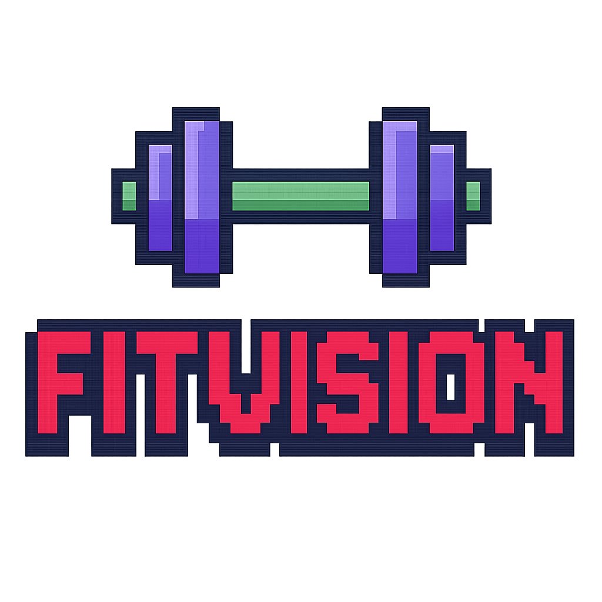

### Personalised workout plans from an AI coach, wrapped in retro pixel art

Answer three quick questions. A pixel-robot coach builds **two different workout plans**
for your equipment, goal and experience level, saves them, and lets you rate them.


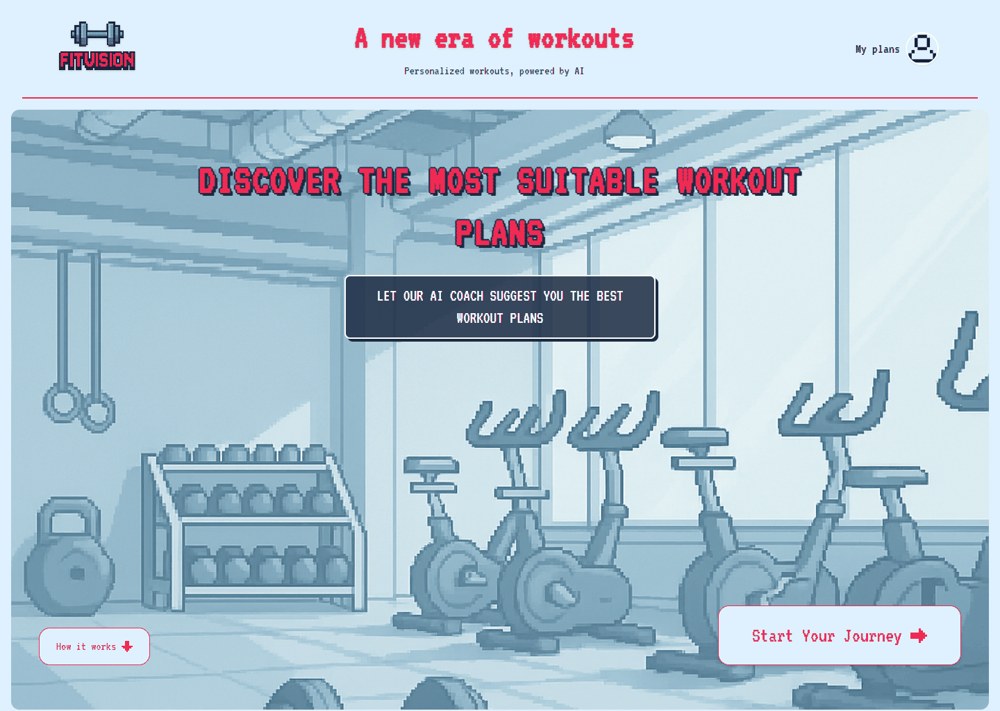

</div>

---

## What it does

FitVision turns "I want to get fitter" into a concrete weekly programme in under ten seconds.

- **A three-step flow.** Name and email, then your experience level, the equipment you own
  (10 options, from *none* to a treadmill) and your goal (8 options, from *lose weight* to
  *prevent injuries*).
- **Two plans that really differ.** The AI is instructed to take two different approaches —
  for example a full-body circuit versus an upper/lower split — never two variations of the same thing.
- **Built only from what you have.** Plans use exclusively the equipment you picked; choose *none* and every exercise is bodyweight.
- **Easy to compare, easy to read.** Each plan shows its title, a short summary, days per week and
  length in weeks. The full programme sits in collapsible sections: *Weekly structure*,
  *Progression*, *Warm-up and recovery*.
- **Rate what you tried.** Five pixel stars and an optional comment, stored with the plan.
- **My plans.** Every plan you have ever been given, newest first, survives refreshes and return visits.
- **Comes back to you.** Return later with new answers and the same account is updated instead of creating a duplicate.

## How it works

<table>
  <tr>
    <td width="33%" align="center"><b>1 · About you</b></td>
    <td width="33%" align="center"><b>2 · Training</b></td>
    <td width="33%" align="center"><b>3 · Your setup</b></td>
  </tr>
  <tr>
    <td>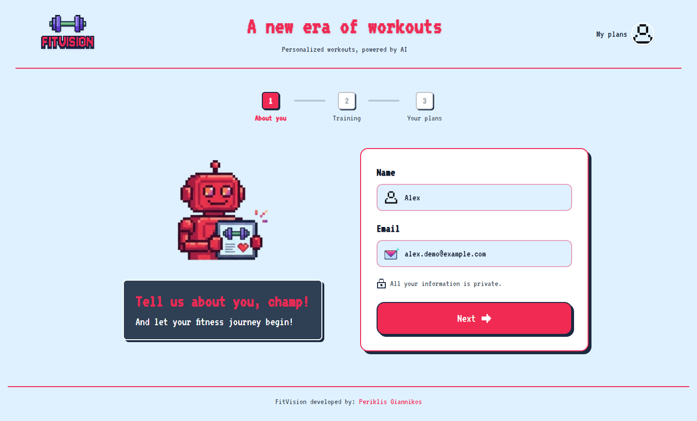</td>
    <td>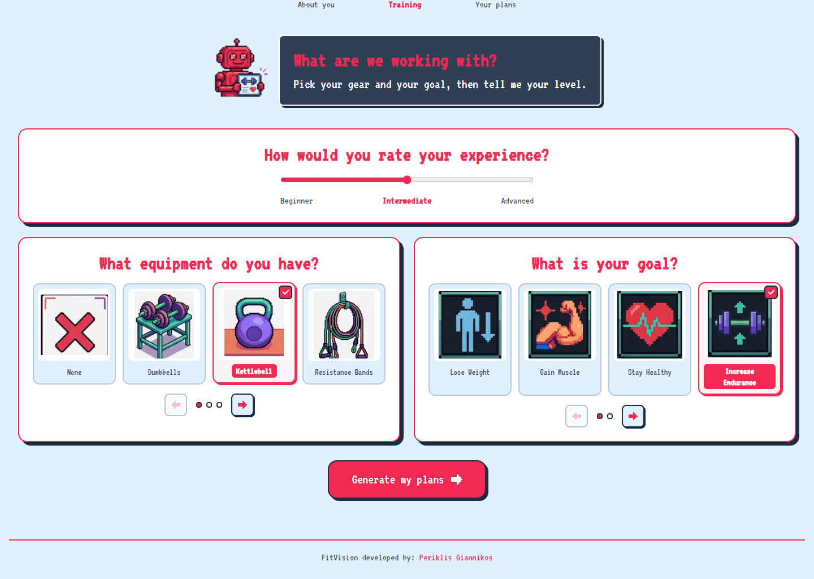</td>
    <td>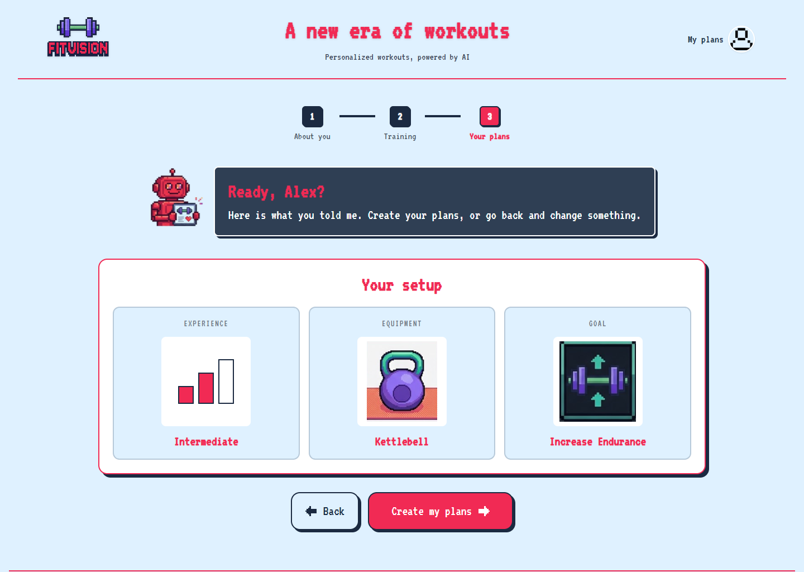</td>
  </tr>
  <tr>
    <td>Validated name and email, with pixel-styled inline errors.</td>
    <td>A slider for the level, picture cards for equipment and goal, paged four at a time.</td>
    <td>A summary of your answers, then <i>Create my plans</i> — or go back and change something.</td>
  </tr>
</table>

<table>
  <tr>
    <td width="50%" align="center"><b>The coach at work</b></td>
    <td width="50%" align="center"><b>Your two plans</b></td>
  </tr>
  <tr>
    <td>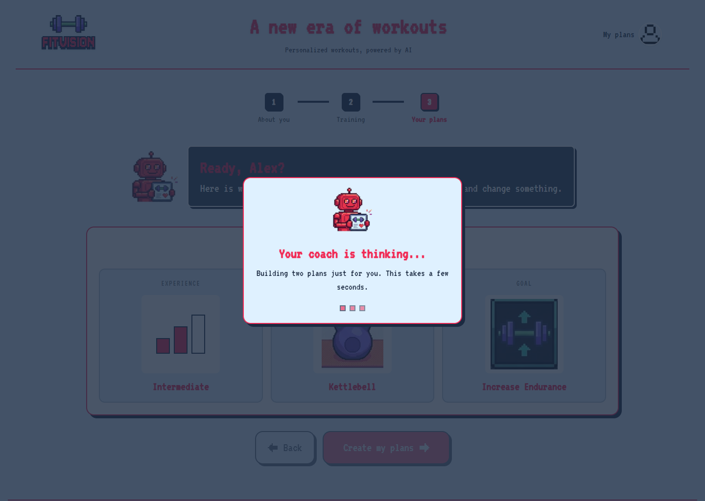</td>
    <td>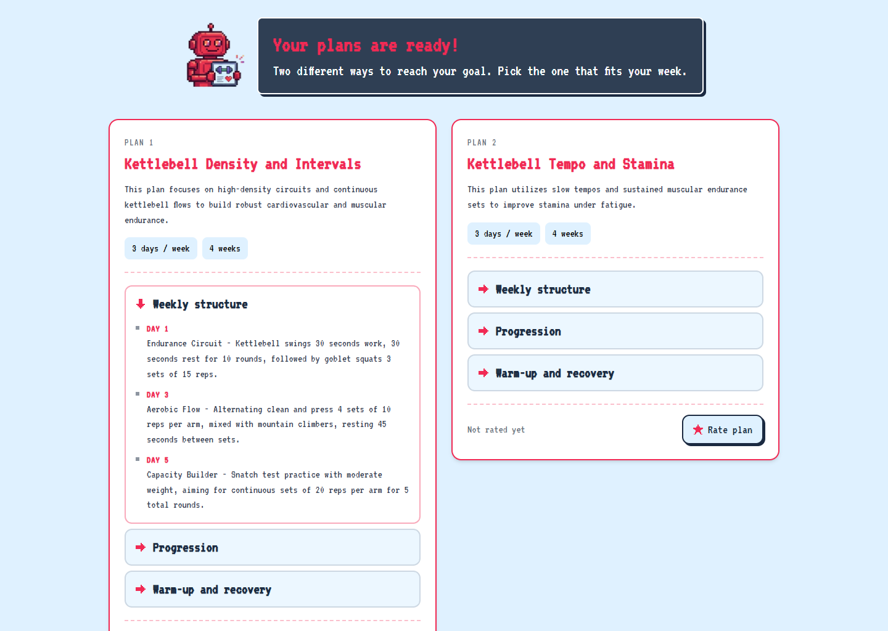</td>
  </tr>
  <tr>
    <td align="center"><b>Rate a plan</b></td>
    <td align="center"><b>My plans</b></td>
  </tr>
  <tr>
    <td>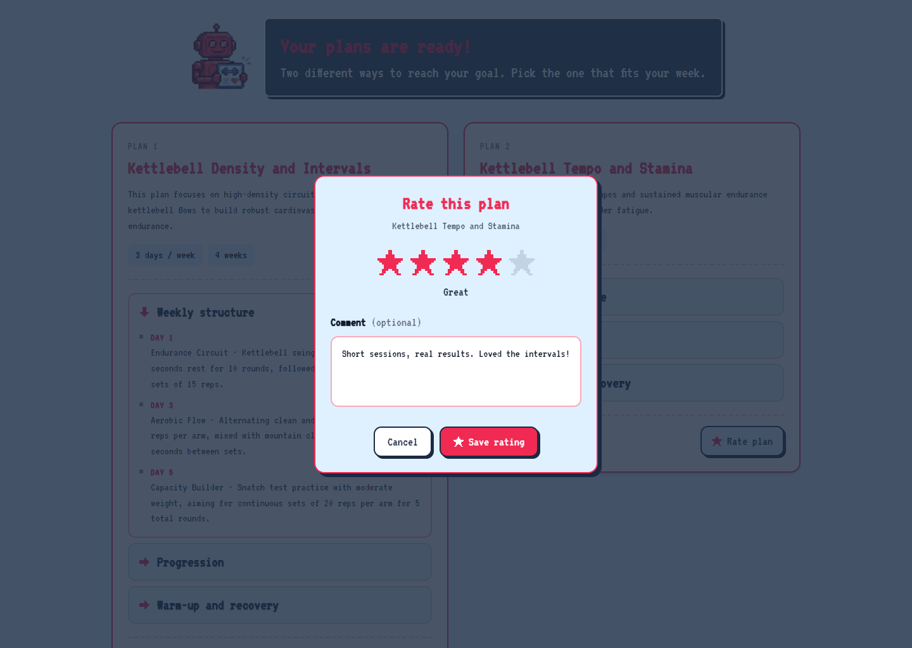</td>
    <td>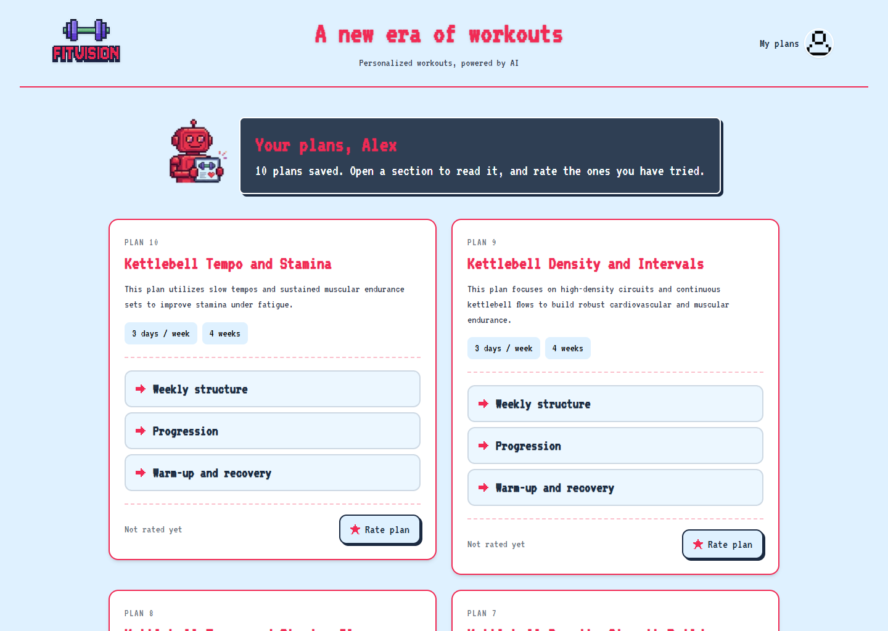</td>
  </tr>
</table>

### Mobile first

Every screen was designed for a phone first and scaled up — no horizontal scrolling at 375px,
stacked buttons, a 2×2 option grid, and the same pixel identity throughout.

<div align="center">
  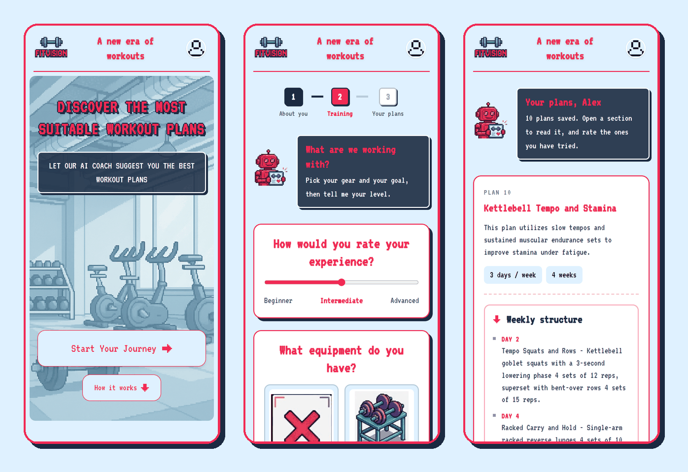
</div>

## Architecture

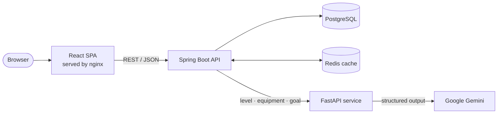

1. The React app collects the answers and sends them to the **Spring Boot** API, which creates
   (or updates) the user in **PostgreSQL**.
2. Spring Boot asks the **FastAPI** service for plans, sending the user's stored level, equipment and goal.
3. FastAPI calls **Gemini** with a system prompt and a **Pydantic response schema**, so the model must
   answer with valid JSON in exactly the expected shape: two plans, each with a title, summary,
   markdown description, duration and days per week.
4. Spring Boot saves the plans and returns them. Repeat reads of a user's plans come from **Redis**,
   and the cache is cleared whenever a plan is added or rated.

## Tech stack

| Layer | Technology | Highlights |
|---|---|---|
| **Frontend** | React 19, Vite 6, React Router 7, Tailwind CSS v4 | Mobile-first layouts; design tokens in `@theme`; pixel-art icons drawn from text grids as crisp SVG; accessible dialogs, radio-group stars and `<details>` sections; graceful loading and error states with retry |
| **Backend** | Spring Boot 3.5, Java 21, Spring Data JPA, Bean Validation, MapStruct, Lombok | Layered controllers / services / DTOs; global exception handler with meaningful 400 / 404 / 409 / 503 responses; WebClient to the AI service |
| **AI service** | Python, FastAPI, Pydantic v2, `google-genai` | Structured output against a Pydantic schema; dedicated system prompt with equipment, level and goal rules; retries with exponential back-off on rate limits; health endpoint |
| **Data** | PostgreSQL 15, Redis 7 | Plans and ratings in Postgres; per-user plan lists cached in Redis with explicit eviction |
| **Infrastructure** | Docker Compose, nginx | Five services with health checks and start-up ordering; nginx serves the SPA with client-side routing fallback and cache headers for hashed assets |

## API

Spring Boot, port `8080`:

| Method | Endpoint | Purpose |
|---|---|---|
| `GET` | `/api/enums/allEnums` | Levels, equipment and goals for the forms |
| `POST` | `/api/users/createUser` | Create a user with their answers (`409` if the email exists) |
| `PUT` | `/api/users/updateUser` | Update a returning user's answers |
| `GET` | `/api/users/getUserById?userId=` | Read a user |
| `DELETE` | `/api/users/deleteUser?userId=` | Delete a user |
| `POST` | `/api/workoutPlans/createUserWorkoutPlanList?userId=` | Generate and save two new plans |
| `GET` | `/api/workoutPlans/getUserWorkoutPlanList?userId=` | All of a user's plans (cached) |
| `GET` | `/api/workoutPlans/getWorkoutPlanById?workoutPlanId=` | Read one plan |
| `PATCH` | `/api/workoutPlans/rateWorkoutPlan?workoutPlanId=&stars=&comment=` | Rate a plan (0–10) with a comment |

FastAPI (internal to the Docker network): `POST /CreateAndGetWorkoutPlans`, `GET /health`.

## Getting started

**Prerequisites:** [Docker Desktop](https://www.docker.com/products/docker-desktop/) and a free
[Google AI Studio](https://aistudio.google.com/) API key.

```bash
git clone https://github.com/Periklas712/FitVision.git
cd FitVision
cp .env.example .env        # then put your Gemini key and a database password in .env
docker compose up -d --build
```

Open **http://localhost:3000**. The API is on `http://localhost:8080`.

### Frontend development with hot reload

With the stack running in Docker, start the Vite dev server for instant updates:

```bash
cd fitvision_frontend
npm install
npm run dev                 # http://localhost:5173
```

## Project structure

```
FitVision/
├── fitvision_frontend/     React + Vite + Tailwind SPA, nginx config, Dockerfile
│   ├── public/             Pixel-art assets (equipment/, goals/, icons/)
│   └── src/assets/
│       ├── components/     Pages and UI pieces (coach dialog, option cards, rating modal…)
│       ├── services/       API client
│       └── utils/          Enum display helpers, saved-user helpers
├── FitVision_backend/      Spring Boot API (controllers, services, DTOs, mappers, Redis config)
├── Fitivsion_Ai/           FastAPI service, Pydantic models, Gemini client, system prompt
├── docs/screenshots/       Images used in this README
├── docker-compose.yml
└── .env.example
```

## Design

The whole interface shares one visual language: the VT323 pixel font, a light-blue canvas, a hot-pink
brand colour, ink-navy outlines with hard offset shadows, and a red pixel robot who talks to you in
RPG-style dialog boxes. Equipment and goal artwork is hand-made pixel art, picked up automatically by
file name (`EXERCISE_BIKE` → `/equipment/exercise_bike.png`).

## Roadmap

- **Feedback loop:** send a plan's rating and comment back to the AI so the next plans improve.
- **Workout logging:** tick off sessions and track progress week by week.
- **Accounts:** proper authentication instead of a browser-stored user id.

---

<div align="center">
  Built by <a href="https://github.com/Periklas712">Periklis Giannikos</a>
</div>
